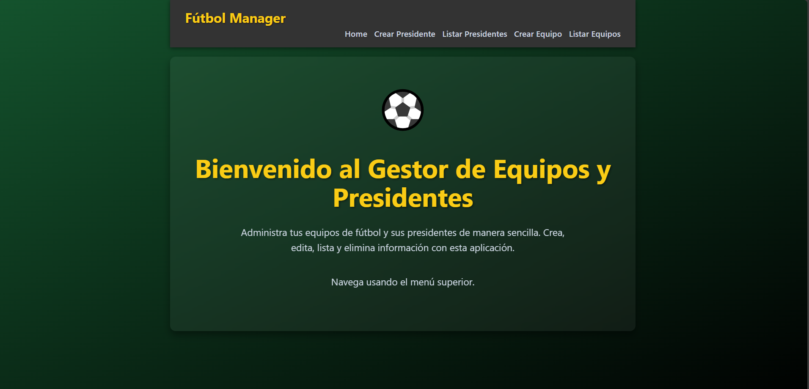

# ⚽ Fútbol Manager

**Fútbol Manager** es una aplicación web desarrollada como proyecto integrador para la gestión de equipos deportivos y sus presidentes. Permite registrar, visualizar, editar y eliminar equipos junto con su respectivo presidente, garantizando una relación uno a uno entre ambas entidades.

---

## 🎯 Objetivos del proyecto

- Gestionar la información de equipos deportivos (nombre, código, año de fundación).
- Asociar a cada equipo un presidente único (DNI y nombre).
- Permitir operaciones CRUD sobre equipos y presidentes.
- Mantener integridad referencial entre entidades.
- Usar una interfaz web clara, fluida y fácil de navegar.

---

## 🛠️ Tecnologías utilizadas

### Frontend:
- React
- TypeScript
- React Router
- React Bootstrap

### Backend:
- Node.js
- AdonisJS (sin ORM)
- PostgreSQL (como sistema de base de datos relacional)

### Lenguajes:
- TypeScript
- SQL (consultas personalizadas)
- JavaScript (en backend AdonisJS)

---

## 🖼️ Funcionalidades principales

- [x] Listado de todos los equipos y sus presidentes.
- [x] Creación de nuevos equipos junto a su presidente.
- [x] Edición de equipos y nombres de presidentes.
- [x] Eliminación de equipos (y su presidente asociado).
- [x] Relación estricta uno a uno entre equipo y presidente.

---

## 👨‍💻 Desarrolladores

- **Bryan Hurtado** – Desarrollador frontend y modelador base de datos.
- **Miguel Mosquera** – Desarrollador backend y coordinador técnico.

---

## 🚀 Instrucciones para ejecutar el proyecto

1. Clonar este repositorio:
   ```bash
   git clone https://github.com/Bryanhurtado0006/futbol_manager.git

instalar dependencias del frontend:
cd front_equipos
cd front_equipos
npm install
npm run dev

instalar dependencias del backend:
cd back_equipo
cd back_equipo
npm install
npm run dev

## 📸 Vista previa


